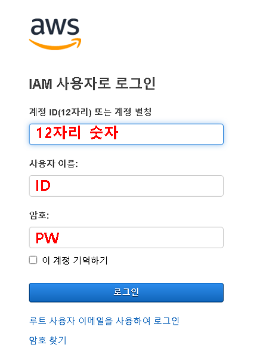

## 1. 콘솔 로그인

1.1 위와 같이 로그인을 하거나 아래와 같이 로그인 창이 뜨면 'IAM 사용자'를 클릭하고 로그인을 진행하면 된다.

## 2. 보안 자격 증명
2.1 좌측 상단의 ID부분을 클릭하고, 보안 자격 증명 페이지로 들어간다.

## 3. 멀티 팩터 인증(MFA)
3.1 멀티 팩터 인증 속성을 찾아 'MFA 디바이스 할당' 클릭

3.2 '가상 MFA 디바이스'로 두고 계속 클릭

3.3 'QR 코드 표시' 클릭 후 QR 코드 나타나는지 확인
 

## 4. 스마트폰에 구글 OTP 셋팅
4.1 스마트폰 스토어를 통해 '구글 OTP' 검색 후 설치 및 실행

4.2 처음 시작하면 아래와 같은 창이 뜨는데 시작하기를 누른다.

4.3 'QR 코드 스캔'을 클릭하여 3.3번에서 나온 QR코드 스캔한다. 만약 여기서 취소를 누르면 구글 OTP 메인 화면으로 넘어가는데 이때 우측 하단의 '+' 버튼을 클릭하여 'QR 코드 스캔'을 누르면 된다.

4.4 그러면 구글 OTP에 'Amazon Web Services(~~~)가 추가가 될 것이다. 이것을 클릭하면 OTP 번호를 확인할 수 있다.

## 5. 확인된 OTP 번호 입력
5.1 클릭하여 확인된 구글 OTP 번호를 입력한다. 처음 OTP번호를 MFA 코드 1에 입력하고, 시간이 지난 후에 바로 나오는 두번쨰 OTP번호를 MFA 코드 2에 입력한다.

